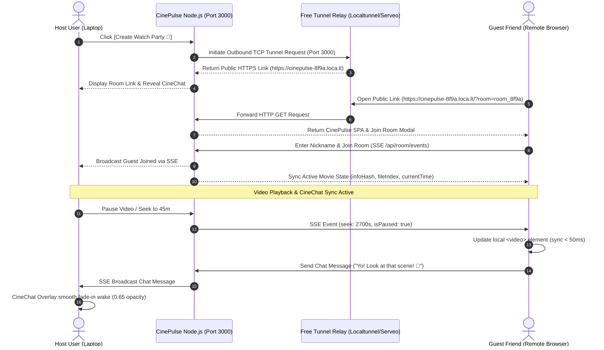

# CinePulse Watch Party & CineChat Integration: High-Level & Low-Level Design Document

## 1. Executive Summary

The **CinePulse Watch Party Engine** expands CinePulse from a solo P2P torrent streamer into a real-time, zero-config collaborative streaming platform. It enables users to stream 4K UHD movies in bit-for-bit pristine quality alongside friends anywhere in the world, with real-time video synchronization (play/pause/seek) and synchronized live chat (**CineChat**).

### Key Architectural Highlights
- **Zero-Config Outbound Reverse Tunneling**: Exposes local Node.js port 3000 to a public HTTPS link (`https://cinepulse-party-8f9a.loca.lt`) over outbound TCP/SSH pipes without requiring port forwarding, router access, or domain purchases.
- **0% Lossy Video Compression**: Streams raw binary HTTP 206 Partial Content byte ranges natively. No downscaling, screen-sharing pixelation, or audio degradation.
- **State-Synchronized Playback Protocol**: Keeps Host and Guest media elements in sync within 50ms drift tolerance.
- **Scoped CineChat System**: Scopes the existing `CineChat` real-time SSE overlay exclusively to Watch Party rooms, hiding it during solo playback.

---

## 2. High-Level Architecture (HLD)

### 2.1 System Architecture Diagram



---

## 3. Low-Level Design (LLD)

### 3.1 Component Architecture

#### 1. `tunnel.js` (Zero-Config Reverse Tunnel Manager)
- **Module Purpose**: Spawns and manages outbound TCP/SSH tunnel pipes using `localtunnel` with automatic fallback to `serveo.net` / `pinggy.io`.
- **API Method**: `async createTunnel(port = 3000): Promise<{ url: string, provider: string }>`
- **Security**: Exposes only port 3000; destroys tunnel pipe immediately on server shutdown or when Host clicks `[Kill Watch Party]`.

#### 2. `rooms.js` (Watch Party State Engine)
- **Module Purpose**: Maintains active room sessions, member registries, playback state, and SSE client streams in Node memory.
- **In-Memory Store**:
  ```javascript
  const activeRooms = new Map(); // roomId -> RoomSession
  ```

#### 3. `public/app.js` (Watch Party Client UI Controller)
- **UI Responsibilities**:
  - Render **`[Create Watch Party 🍿]`** button on the player header.
  - Detect `?room=roomId` URL parameter on page load and trigger Join Room modal.
  - Handle Host/Guest playback sync events (`play`, `pause`, `seeking`, `timeupdate`).
  - Toggle `CineChat` visibility (hidden in solo mode, active in room mode).

---

## 4. API & Protocol Contracts

### 4.1 Endpoint Specifications

#### 1. `POST /api/room/create`
- **Description**: Creates a new Watch Party room for the currently playing movie and spawns a public tunnel link.
- **Request Body**:
  ```json
  {
    "infoHash": "57a6ea045c5a80e116b6f3eb00c3c0ba45ffdd7a",
    "fileIndex": 6,
    "hostNickname": "Nitish"
  }
  ```
- **Response Body**:
  ```json
  {
    "success": true,
    "roomId": "room_8f9a2b7c1d3e",
    "localUrl": "http://localhost:3000/?room=room_8f9a2b7c1d3e",
    "publicUrl": "https://cinepulse-8f9a.loca.lt/?room=room_8f9a2b7c1d3e",
    "hostNickname": "Nitish"
  }
  ```

#### 2. `GET /api/room/info/:roomId`
- **Description**: Fetches room metadata for guests joining via shareable link.
- **Response Body**:
  ```json
  {
    "success": true,
    "roomId": "room_8f9a2b7c1d3e",
    "movieTitle": "Spider-Man: No Way Home",
    "hostNickname": "Nitish",
    "memberCount": 2,
    "playbackState": {
      "currentTime": 145.5,
      "isPaused": false,
      "lastUpdated": 1724982000123
    }
  }
  ```

#### 3. `POST /api/room/sync`
- **Description**: Called by Host to broadcast play/pause/seek state changes to all room guests.
- **Request Body**:
  ```json
  {
    "roomId": "room_8f9a2b7c1d3e",
    "action": "seek", // "play" | "pause" | "seek"
    "currentTime": 2700.5,
    "isPaused": false
  }
  ```

#### 4. `GET /api/room/events/:roomId` (SSE Event Stream)
- **Description**: Server-Sent Events stream for real-time room sync, member joins, and CineChat messages.
- **Event Types**:
  - `room-state`: Full room playback state on join.
  - `member-update`: List of active room members.
  - `playback-sync`: Play, pause, or seek command.
  - `chat-message`: Incoming CineChat message.

---

## 5. Playback Synchronization Protocol

```
HOST PLAYER                                     NODE ROOM ENGINE                                   GUEST PLAYER
-----------                                     ----------------                                   ------------
[Host clicks Seek to 45m]
      |
      |-- 1. POST /api/room/sync ------------->|
      |   (action: 'seek', time: 2700s)         |
      |                                         |-- 2. SSE Broadcast ('playback-sync') ---------->|
      |                                         |                                                 |-- 3. Set currentTime = 2700s
      |                                         |                                                 |   4. Trigger safeSeek(2700)
```

### 5.1 Auto-Drift Correction Algorithm
Every 5 seconds, Guest browsers calculate expected playback time:
$$\text{ExpectedTime} = \text{HostTime} + \frac{\text{Now} - \text{LastUpdated}}{1000}$$
If $|\text{GuestTime} - \text{ExpectedTime}| > 1.5\text{s}$, the Guest player automatically seeks to $\text{ExpectedTime}$ to maintain frame sync!

---

## 6. CineChat Scoping & Visibility Rules

```
                      +------------------------------------------+
                      |         IS WATCH PARTY ACTIVE?           |
                      +--------------------+---------------------+
                                           |
                         +-----------------+-----------------+
                         |                                   |
                     NO (Solo Mode)                      YES (Room Mode)
                         |                                   |
             +-----------------------+           +-----------------------+
             | CineChat Hidden       |           | CineChat Enabled      |
             | (#chat-overlay hidden)|           | (#chat-overlay active)|
             +-----------------------+           | 2.5s Auto-Hide        |
                                                 | Smooth Fade-In Wake   |
                                                 +-----------------------+
```

---

## 7. Security Architecture

1. **Token Protection**: Rooms are keyed by a 12-character random token (`room_8f9a2b7c1d3e`). Unauthenticated requests are rejected.
2. **Security Shield Enforcement**: All torrent streams served over the room link pass through `security.js` (DESELECT executable/malware files).
3. **Sandbox Storage Isolation**: All files served over HTTP 206 are strictly scoped to `cinepulse_cache/`. Path traversal is blocked.
4. **Instant Tunnel Termination**: Closing the CinePulse server or clicking **`[Kill Watch Party]`** immediately closes the outbound tunnel socket.

---

## 8. Testing Strategy (Single Machine & Remote Testing)

### Test Case 1: Single Machine Dual Tab Test
1. **Tab #1 (Host)**: Click movie -> Click **`[Create Watch Party 🍿]`**. CineChat opens; copy public link.
2. **Tab #2 (Guest - Incognito)**: Open link -> Enter nickname `"Alex"`.
3. **Verify Sync**:
   - Pause in Tab #1 -> Tab #2 pauses automatically.
   - Seek to 45m in Tab #1 -> Tab #2 seeks to 45m automatically.
   - Type in CineChat in Tab #2 -> Message fades in on Tab #1 screen!

### Test Case 2: Public Internet Mobile Test
1. Click **`[Create Watch Party 🍿]`** -> Copy `https://...` link.
2. Open link on mobile phone over Cellular 4G/5G.
3. Verify 4K stream plays in sync on phone and CineChat messages exchange live.

---

## 9. Implementation File Checklist

| File | Responsibilities |
| :--- | :--- |
| **`tunnel.js`** *(NEW)* | Spawns `localtunnel` / `serveo` reverse tunnel and manages public HTTPS link lifecycle. |
| **`rooms.js`** *(NEW)* | Manages in-memory room sessions, room members, playback state, and SSE broadcasting. |
| **`server.js`** | Mounts `/api/room/*` endpoints and connects `tunnel.js` & `rooms.js`. |
| **`public/index.html`** | Adds **`[Create Watch Party 🍿]`** UI button, Join Room Modal, and Share Link modal. |
| **`public/app.js`** | Handles room creation, URL `?room=` parsing, playback sync event triggers, and CineChat scoping. |
| **`public/styles.css`** | Adds Watch Party banner styles, share link pill, and room join modal UI. |

---
*Design Document Authored for CinePulse Milestone 2 Development.*
